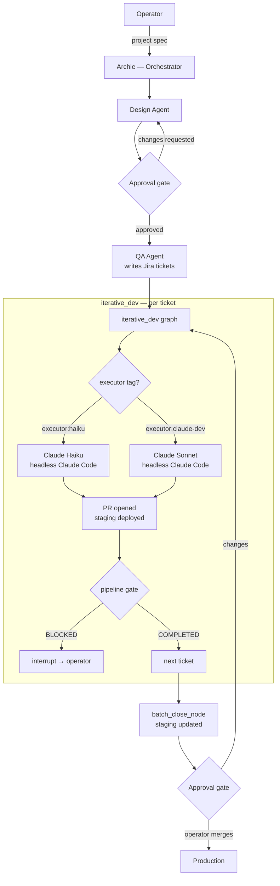

# AppFactory

A multi-agent AI pipeline built on LangGraph and Claude. AppFactory takes a Jira ticket backlog and produces merged, staging-deployed pull requests — running Design, QA, and Development agents in sequence through explicit human approval gates.

The orchestrating agent is **Archie** — a persistent AI architect with memory, judgment, and a defined set of rules it cannot override. Archie coordinates the pipeline, challenges decisions, and surfaces blockers. It does not merge PRs, does not act without approval on state-modifying operations, and does not self-escalate past its constraints.

---

## The problem this solves

Most AI coding tools operate as capable but unconstrained assistants. They will attempt whatever they are asked, make product decisions outside their brief, and proceed past blockers rather than flagging them. At small scale this is convenient. At pipeline scale — where an agent runs unattended against a production codebase — it is a liability.

AppFactory is designed around the opposite premise: **constraints are the product**. Each agent in the pipeline has a defined scope, explicit rules about what it can and cannot do, and typed interrupt states that surface decisions to the operator rather than making them autonomously. The human-in-the-loop is not a fallback — it is the architecture.

---

## Pipeline architecture



The pipeline never merges to main. That decision belongs to the operator, after reviewing the deployed staging environment.

---

## Key design decisions

### Human-in-the-loop via MCP interrupt

Approval gates are not implemented as chat messages or notifications — they are typed LangGraph interrupts surfaced directly into the operator's working session via the `langgraph-mcp` MCP server. The operator sees the gate context in their IDE or CLI, approves or redirects, and the pipeline resumes. The mechanism is synchronous from the operator's perspective; the pipeline is asynchronous in the background.

### Executor routing — Haiku vs Sonnet

QA tickets carry an `executor` label (`executor:haiku` or `executor:claude-dev`). The `iterative_dev` graph reads this label and routes accordingly. Haiku handles well-scoped, known-file-path tickets at roughly one-quarter the cost of Sonnet. Sonnet handles architectural changes, EF Core migrations, and anything requiring judgment. The routing decision is made by the QA agent at ticket-writing time, not inferred at runtime.

### Agent constraints as CLAUDE.md

Each agent's behaviour is defined in a `CLAUDE.md` file loaded at session start. These files specify the agent's scope, what it can do without approval, what requires operator sign-off, and what is unconditionally banned (merging PRs, exceeding search budgets, self-escalating to deep research). The constraints are not suggestions — they are the operating contract. See the `agents/` directory for all seven agent definitions.

### Typed interrupt states

When an agent cannot complete its task, it does not retry silently or make a best-guess decision. It returns one of three typed states: `COMPLETED`, `BLOCKED` (with a specific reason), or `RESEARCH_NEEDED` (with a single specific question). The pipeline routes each state explicitly — `BLOCKED` fires a human interrupt, `RESEARCH_NEEDED` dispatches the Research agent and re-queues the ticket. There is no silent failure mode.

### Staging-first deployment

Every project requires a staging environment before Development begins. The pipeline deploys to staging automatically at the end of each sprint batch. The operator reviews the running application at a URL — not a diff, not a PR description. Staging is always live; the operator's merge decision is based on what they can see and click.

---

## Repository structure

```
graphs/              LangGraph pipeline graphs
  iterative_dev.py     Main development pipeline — ticket → PR → staging
  qa_batch.py          QA pipeline — spec → ordered Jira ticket batch
  research_only.py     Standalone research graph with budget enforcement
  infra_task.py        Infrastructure operations with tiered approval
  staging_deploy.py    SSH staging deploy helper (configurable via env vars)
  workspace.py         Ephemeral clone-per-run workspace management
  github_api.py        GitHub API wrapper (branches, PRs, merge state)
  state.py             Shared pipeline state type definitions
  tracing.py           Langfuse OTEL tracing — shared across all graphs
  knowledge.py         Qdrant operational knowledge retrieval
  research_gate.py     Research budget enforcement across graph nodes

tests/               Full pytest suite for all graph modules

agents/              Sanitised agent definitions (CLAUDE.md files)
  orchestrator.md      Archie — pipeline coordination and approval gates
  design.md            UI/UX design system and Claude Design super-prompts
  qa.md                Jira ticket authoring with executor tagging
  development.md       Code implementation — two-mode (interactive / headless)
  infrastructure.md    Server operations with tiered approval model
  research.md          Bounded web research with hard budget limits
  risk-ethics.md       Legal exposure, data handling, deployment readiness
  ventures.md          Commercial viability and route-to-market analysis

mcp-servers/
  langgraph-mcp/       TypeScript MCP server — dispatch, interrupt, observability
  infisical-mcp/       TypeScript MCP server — secrets retrieval via Infisical
```

---

## Configuration

The pipeline is configured via environment variables. No credentials are hardcoded.

| Variable | Description |
|----------|-------------|
| `APPFACTORY_DEPLOY_HOST` | SSH target for staging deploy, e.g. `root@<server>` |
| `APPFACTORY_STAGING_BASE` | Base path for staging stacks, e.g. `/mnt/<pool>/apps` |
| `APPFACTORY_WORKSPACE_ROOT` | Temp clone root on the VM (default: `/tmp/appfactory-runs`) |
| `APPFACTORY_ARTEFACT_ROOT` | Run artefact archive path (default: `~/run-artefacts`) |
| `LANGGRAPH_API_URL` | LangGraph Platform endpoint |
| `LANGSMITH_API_KEY` | LangGraph Platform API key |
| `LANGFUSE_BASE_URL` | Langfuse observability host |
| `LANGFUSE_PUBLIC_KEY` / `LANGFUSE_SECRET_KEY` | Langfuse credentials |
| `GITHUB_TOKEN` | PAT with Contents and Pull Requests scope |

---

## Tech stack

**Pipeline:** Python, LangGraph, LangChain, Claude API (Anthropic)  
**MCP servers:** TypeScript, Model Context Protocol SDK  
**Observability:** Langfuse (OTEL tracing via `@observe` decorator)  
**Knowledge retrieval:** Qdrant, OpenAI text-embedding-3-small  
**Secrets:** Infisical  
**CI/CD:** GitHub Actions — `:staging` tag on PR open, `:latest` on merge to main  
**Infrastructure:** Docker Compose, self-hosted Linux VM

---

## Status

The pipeline graphs are implemented and sandbox-tested. End-to-end production validation is planned — the intended first full run is the MusicPracticeApp project, a multimodal AI music teacher application that will serve as the real-world proving ground for the full Design → QA → Development pipeline.

The portfolio site at [geoff-walker.uk](https://geoff-walker.uk) was built alongside AppFactory development. The AppFactory deep-dive page documents the architecture and the human-in-the-loop design in detail.

---

## About

Built by [Geoff Walker](https://geoff-walker.uk) — AI Systems Engineer.  
[LinkedIn](https://www.linkedin.com/in/geoff-walker-a3ab02227) · [FamilyCookbook](https://github.com/Geoff-Walker/FamilyCookbook)
